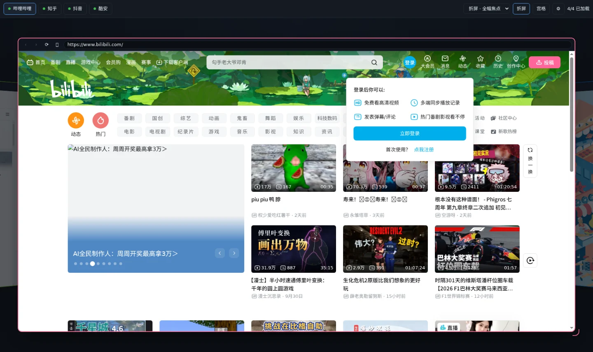
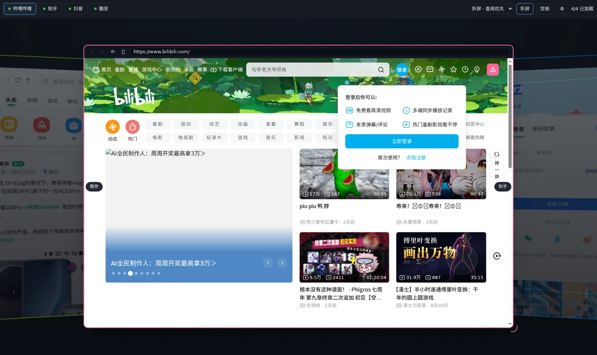
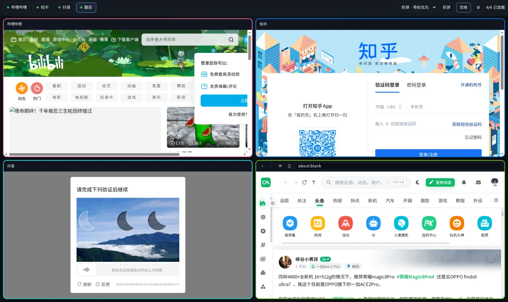
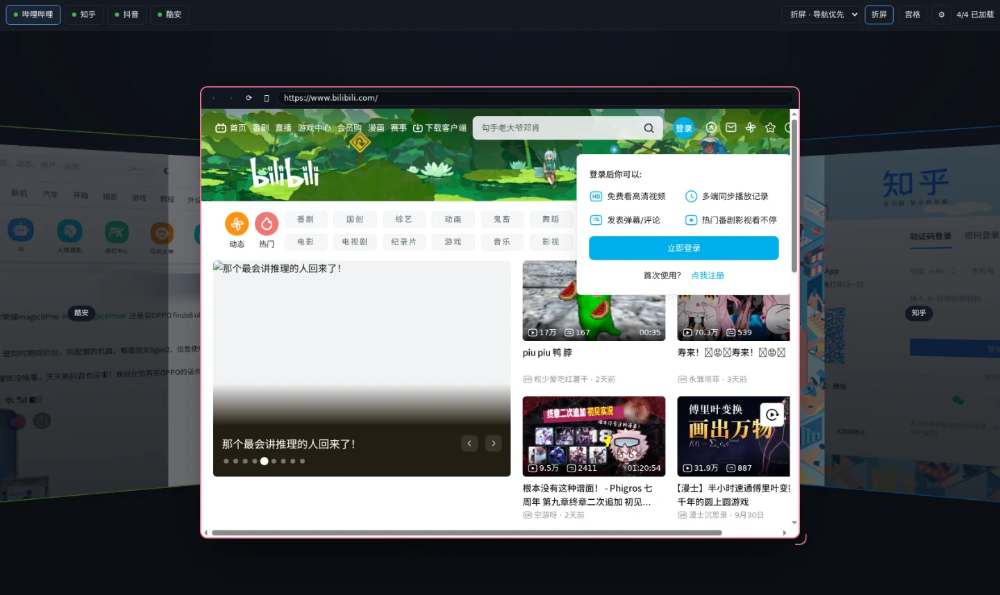
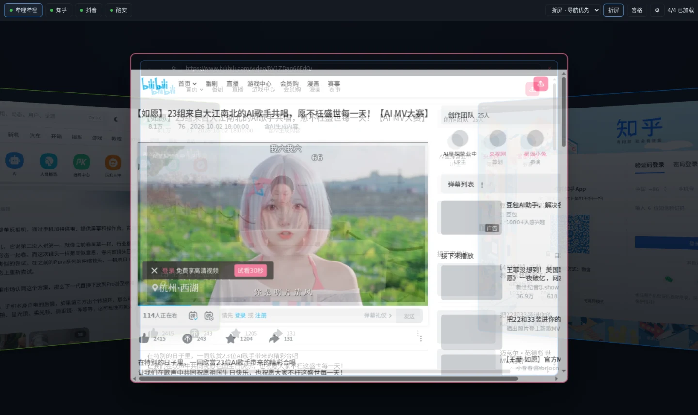
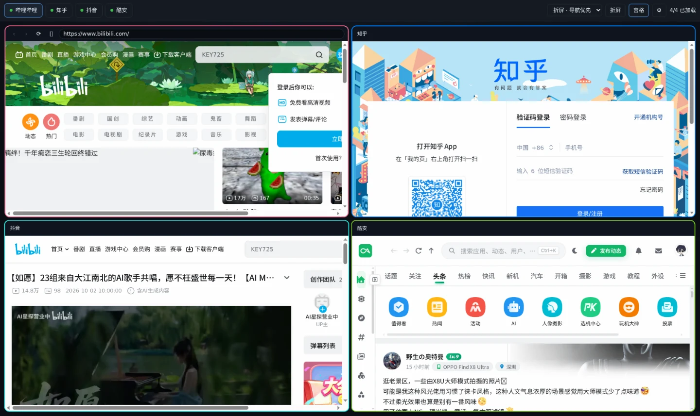
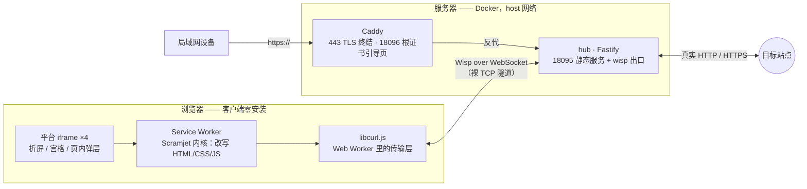

<div align="center">

# zoetrope · 西洋镜

**一个浏览器窗口，并排看多个社媒平台。**
焦点视图完整可交互，邻位侧立可读，远端退到暗处 —— 客户端零安装，打开网页就能用。




</div>

---

## 这是什么

社媒平台天然占满整个标签页。想同时盯几个，就得来回切、还得记住哪个在响。

zoetrope 把它们放进**一个页面**：每个平台一个独立视图，按 3D「折屏」排布，
滚轮或方向键切焦点，键盘鼠标全部作用在当前焦点上。名字取自西洋镜 ——
一个箱子里装着好几幅画，一次只看得到一幅，靠转动切换。

**关键取舍：不做像素流。** noVNC / WebRTC 那条路要在服务端跑真浏览器再逐帧传回来，
延迟、音频、输入法、视频硬解每一项都是坑。这个项目改成**拦截式反代**：
服务端只做 URL 改写与响应头剥离，页面的解析、执行、渲染全部发生在**你自己浏览器的真实引擎**里。

| | 像素流（noVNC / WebRTC） | **zoetrope（拦截式反代）** |
|---|---|---|
| 服务端算力 | 每个会话一个真浏览器 | 只转发字节 |
| 输入法 | 需要专门通道 | 原生 |
| 音频 / 视频硬解 | 需要专门通道 / 二次编码 | 原生 |
| 延迟 | 逐帧编码 + 传输 | 与直连同量级 |
| 客户端 | 通常是 VNC 客户端或特殊页面 | **任何浏览器，零安装** |

代价是兼容性：站点必须能经受 URL 改写，且风控会把代理链路和真浏览器区分开
（见[验证结果](#验证结果)里的抖音）。

## 效果

<table>
<tr>
<td width="50%"><br><sub><b>折屏 · 查阅优先</b> —— 3D 感收敛，焦点与两个邻位都可读</sub></td>
<td width="50%"><br><sub><b>宫格总览</b> —— 一键摊平，四块同时可读</sub></td>
</tr>
<tr>
<td width="50%"><br><sub><b>折屏 · 导航优先</b> —— 3D 感最强，邻位是侧板；<br>名字用屏幕空间标签绘制，不随面板一起被重采样</sub></td>
<td width="50%"><br><sub><b>页内子视图</b> —— 视频在弹层里播，主视图继续用来翻列表</sub></td>
</tr>
</table>

<details>
<summary><b>宫格 ↔ 折屏的展平过渡（FLIP）</b></summary>



四块面板用 FLIP 从折屏位置插值到宫格位置，上面是动画进行中的抓帧。
反向（宫格 → 折屏）看起来像把摊开的纸重新折起来。

</details>

## 特性

| | |
|---|---|
| 🪟 **折屏多视图** | 3D 折屏排布 + 宫格总览；三档预设（导航 / 查阅 / 全幅）；每个视图可各自拖拽改尺寸 |
| 🎯 **焦点三档节流** | 焦点完整渲染 · 邻位侧立压暗 · 远端 `content-visibility` 停渲染并暂停媒体 |
| 🪟 **页内子视图** | 拦截 `target=_blank` / `window.open` / ⌥·Ctrl·⌘·中键点击 → 页内弹层，不再弹出真标签页；弹层内链接原地换页 |
| 🔐 **登录态持久** | Cookie 罐落到 IndexedDB，Service Worker 冷启动会**先回填再处理请求**（否则每次回收都掉登录） |
| ⌨️ **每视图自带控制栏** | 后退 / 前进 / 刷新 / 地址栏 / ⧉ 弹层；`Ctrl+R` 刷新焦点视图而不是整页 |
| ⚙️ **站点可配置** | 顶栏 ⚙ 或 `Ctrl+,` 编辑站点列表与地址，支持 `{host}` 占位符保证同站 |
| 📱 **任何设备** | 纯网页，手机 / 平板 / 电视浏览器都能开，服务端跑在局域网的一台机器上 |

## 架构



一次请求的路径：

1. iframe 请求代理地址 → 被 **Service Worker** 拦截；
2. Scramjet 把地址解码回真实 URL，交给**传输层**；
3. 传输层开一条 **Wisp over WebSocket** 到 hub，hub 用裸 TCP 连目标站点；
4. 响应流回浏览器，Scramjet **改写 HTML/CSS/JS 里的地址与响应头**，交给 iframe 渲染。

服务端全程只看得到"一条 TCP 隧道"，看不到明文之外的任何东西，也不需要为每个用户准备浏览器进程。

## 快速开始

**前置**：Docker、Node ≥ 22、`git submodule`。

```bash
git clone git@github.com:Dynesshely/zoetrope.git
cd zoetrope

git submodule update --init        # 拉 vendor/Scramjet-App（proxy/Dockerfile 要用它的依赖清单）
export DOCKER_CONFIG=~/.docker-config   # 需要 registry 认证 / 构建期出网代理时

make build                         # 构建镜像
make up                            # 生成自签证书 + 启动 hub 与 Caddy
make url                           # 打印访问地址
```

<details>
<summary><b>仓库里没有的东西</b>（<code>.gitignore</code> 有意排除，都要自己生成或拉取）</summary>

| 路径 | 怎么来 |
|---|---|
| `tls/certs/` | `make certs` 生成。内含 `ca.key` / `server.key`，**绝不入库** |
| `vendor/Scramjet-App/` | git 子模块，`git submodule update --init`。`proxy/Dockerfile` 会 `COPY` 它的 `package.json` + `pnpm-lock.yaml` |
| `verify/*/`、`verify/*.png` | 验证脚本的产物（累计约 239 MB），不入库；脚本本身 `verify/*.mjs` 是入库的 |

</details>

<details>
<summary><b>全部 make 目标</b></summary>

```bash
make certs         # 生成自签根 CA + 服务器证书（已存在则跳过）
make renew-certs   # 强制重新生成叶子证书（它 397 天到期；根 CA 十年有效，客户端不用重装）
make build / up / down / restart
make logs          # 跟随容器日志
make url           # 打印访问地址
make probe         # hub 健康检查
make check-cert    # 用 openssl 校验证书链
make verify        # 无头验证 HTTP 端
make verify-https  # 无头验证 HTTPS 端 → verify/out-https/
make shell         # 进 hub 容器
```

</details>

## 访问入口

| 用途 | 地址 | 需要装证书？ |
|---|---|---|
| **桌面（SSH 隧道，最快）** | `http://127.0.0.1:18095/` | **不需要** |
| **其他设备（手机 / 平板 / 电视）** | `https://<主机IP>/` | 需要，装一次 |
| **根证书引导页** | `http://<主机IP>:18096/` | —— |

### 路径一：SSH 隧道（零证书，桌面首选）

`127.0.0.1` 属于浏览器的可信来源，本身就是安全上下文，Service Worker 直接可用。
第二条转发是给"自建酷安"这类**直连模式**站点用的 —— 它们必须与 hub **同站**，
否则 `SameSite=Strict` 的会话 Cookie 不会发送：

```bash
ssh -N -L 18095:127.0.0.1:18095 -L 17520:127.0.0.1:17520 <user>@<主机>
# 然后浏览器打开 http://127.0.0.1:18095/
```

写进 `~/.ssh/config` 可免每次敲：

```
Host zoetrope
    HostName <主机>
    LocalForward 18095 127.0.0.1:18095
    LocalForward 17520 127.0.0.1:17520
```

### 路径二：装根证书

打开 `http://<主机IP>:18096/`（明文 HTTP，不会有证书警告），页面里有各系统的安装步骤。

### ⚠️ 为什么"点过证书警告"不能用

一个常见的误解是"https 有加密就行，浏览器报不安全无所谓"。**这条路是死的。**
实测（`verify/cert-bypass-check.mjs`，用 CDP 的 `Security.setOverrideCertificateErrors` +
`handleCertificateError(continue)` 精确模拟用户点"继续"）：

```
收到 Security.certificateError: ERR_CERT_AUTHORITY_INVALID
已代替用户执行 continue（等价于点过警告）
isSecureContext : true          ← 页面确实被当成安全上下文
registerResult  : REGISTER_FAIL  SecurityError:
                  Failed to register a ServiceWorker for scope ('https://…/')
                  with script ('https://…/sw.js'):
                  An SSL certificate error occurred when fetching the script.
__ZOETROPE.ready : false
```

**`isSecureContext` 是 `true`，Service Worker 依然被硬性拒绝。** 点"继续"只让页面能显示，
不会让浏览器信任该来源去注册 Service Worker —— 而整个代理就架在 Service Worker 上。
同理，局域网 IP 上的明文 HTTP 也不是安全上下文。

## 站点配置

顶栏 ⚙（或 `Ctrl+,`）编辑站点列表，改完点「保存并应用」会重载页面。
配置存在 `localStorage["zoetrope.sites"]`，清掉即回到 `proxy/public/platforms.js` 的默认值。

地址支持 `{host}` 占位符，会替换成**你打开本页用的主机名** —— 这是为了让直连模式站点
与 hub 保持同站（见上）。也可以填 `urlTemplateHttps`，在 HTTPS 入口下用另一个端口。

## 键盘与鼠标

| 操作 | 效果 |
|---|---|
| `[` / `←`、`]` / `→`、滚轮 | 切换焦点视图 |
| `g` / `G` | 折屏 ↔ 宫格（带展平过渡） |
| `Ctrl+R` / `⌘R` | 刷新**焦点视图** |
| `Ctrl+Shift+R` / `⌘⇧R` | 刷新整个页面 |
| `Ctrl+1`…`9` | 直接聚焦第 N 个视图 |
| `Ctrl+,` / `⌘,` | 打开站点设置 |
| `Esc` | 关设置 → 关弹层 → 回折屏 |
| 点非焦点视图的暗色遮罩 | 聚焦该视图 |
| 拖右下角手柄 / 双击 | 改尺寸 / 复位（手柄在视图**外侧**） |
| `⌥`·`Ctrl`·`⌘` + 点链接，或中键点链接 | 在页内弹层中打开（不弹真标签页） |
| 控制栏 `⧉` | 把当前页在弹层里打开 |

## 目录结构

```
docker-compose.yml      hub（代理 + 页面） + tls（Caddy TLS 终结）
Makefile                构建 / 证书 / 验证的入口
proxy/
  Dockerfile            复用 vendor/Scramjet-App 的依赖清单，只替换 src/ 与 public/
  src/index.js          Fastify：/  /scram/  /libcurl/  /baremux/  /wisp/  /healthz
  public/index.html     多视图界面与全部样式
  public/hub.js         视图调度、折屏布局、弹层、设置；window.__ZOETROPE 供自动化读取状态
  public/platforms.js   平台清单 ← 改这里增删平台
  public/sw.js          Scramjet Service Worker（含 cookie 罐冷启动回填）
tls/
  gen-certs.sh          生成自签根 CA + 服务器证书（SAN 含 LAN IP）
  Caddyfile             443 TLS 终结 → 127.0.0.1:18095；18096 提供 CA 下载
  certs/                ca.crt / ca.key / server.crt / server.key（不入库）
  site/                 证书安装引导页
docs/images/            README 用图（WebP，由 verify/doc-images.mjs 生成）
verify/*.mjs            无头 CDP 验证脚本：截图 + 断言，产物不入库
vendor/Scramjet-App/    上游参考实现（只读，git 子模块）
DESIGN.md               → 方案论证、被否掉的路线、逐轮实测结论
UI.md                   → UI 设计、性能纪律、逐轮需求与踩坑记录
```

## 关键环境适配

都是本机实测踩出来的，别人复现时最可能撞上的东西：

| # | 问题 | 现象 | 处理 |
|---|---|---|---|
| 1 | **传输层 WASM 懒加载，第一个请求必被拒** | `platforms[0]` **间歇性加载失败**（约 50%），日志 `wasm not loaded yet, please call libcurl.load_wasm first` | 创建 frame 之前先用 `scramjet.encodeUrl()` 打一个极小的预热请求，直到成功（`warmUpTransport`）。修复后连续 5 轮 5/5 |
| 2 | **wisp 默认 `dns_result_order="verbatim"`，先解析 AAAA** | 目标有 AAAA 记录时（bilibili 就有）代理**间歇性 500** | 自定义 `dns_method`：只用系统解析器取 IPv4，任何情况下都不回退 AAAA。本机无 IPv6 路由，wisp 又是裸 TCP、不做 happy-eyeballs |
| 3 | Wisp 走**裸 TCP**，不经过 `HTTP_PROXY` | 上游默认用 Cloudflare 的 1.1.3 做解析器，本网络不通 | 改用系统解析器（`dns_method`） |
| 4 | npm registry 在 Cloudflare 上，容器直连不通 | 构建期装不上依赖 | 构建期经 `DOCKER_CONFIG` 里的代理；运行期不需要 |
| 5 | 无头 Chromium 缺中文字体 | 截图里中文全是 □ | `FONTCONFIG_FILE=…/fonts.conf` |
| 6 | Service Worker 需要安全上下文 | 局域网 `http://10.x.x.x` 无法注册 SW | Caddy 在 443 做 TLS 终结；或走 SSH 隧道用 `127.0.0.1` |
| 7 | **"点过证书警告"不等于信任** | https 页面能显示，但 SW 被 `SecurityError` 硬拒 | 必须真正装根 CA，或走 `127.0.0.1` 隧道。实测见 `verify/cert-bypass-check.mjs` |
| 8 | **COEP 会拦掉跨源 iframe** | 直连模式站点即使 `credentialless` 也白屏 | COEP 默认 `off`（`COEP=credentialless` 可切回） |
| 9 | **直连模式站点必须与 hub 同站** | 会话 Cookie 是 `SameSite=Strict`，跨站不发送 → 报「缺少或无效的会话 token」 | 用 `platforms.js` 的 `{host}` 占位符按 hub 自己的主机名拼地址 |
| 10 | **`decodeUrl()` 对非代理地址会无条件切片** | 「在弹层里打开视频」弹出空白子视图；而且**只有长的 URL 中招**，短的反而正常，看起来像随机 | 调用前先判断地址确实以 `origin + "/scramjet/"` 开头，且只接受 `http(s)://` 形式的解码结果 |
| 11 | **面板的 z-index 比弹层高** | 弹层看起来"半透明"（其实是面板 `opacity: 0.72` 盖在上面），遮罩也从来没压暗过任何面板 | 层级写成契约：面板 `10-\|d\|`（焦点 20）< `#veil` 30 < `#overlay` 31 |
| 12 | **四个同源 iframe 挤在同一个渲染进程里同时开** | 各平台首屏明显慢于原生标签页 | 按「到焦点的环绕距离」分三批放行导航；远端面板 `content-visibility: hidden` 停渲染。bilibili 首屏 complete 7.7s → 3.8s |

10–12 的完整定位过程（含像素级判定与计时数据）见 [UI.md](UI.md) §16–§17。

## 验证结果

| 平台 | 结论 | 证据 |
|---|---|---|
| **哔哩哔哩** | ✅ **完全可用** | 1500+ 节点；首页导航 / 搜索 / 轮播 / 视频卡全部正常。**视频可播放**：`<video>` `readyState=4`、`duration=257s`、`currentTime` 持续推进、`error=null`，DASH 分片来自 `mcdn.bilivideo.cn`（`206`） |
| **知乎** | ✅ **可用** | 240 节点；302 到 `/signin`（未登录的正常行为），扫码 / 验证码 / 密码三种登录表单完整渲染 |
| **自建酷安 Web 版** | ✅ **可用**（直连模式） | 信息流、帖子图片、用户信息、本月热榜、热门话题全部渲染。前提见下 |
| **抖音** | ❌ **被风控拦在代理链路上** | 落到「验证码中间页」。**已排除框架检测**：顶层文档打开同一代理 URL 同样是验证码页 |

**HTTP 与 HTTPS 两条链路都验证过**：证书链 `Verify return code: 0 (ok)`；
SAN 覆盖 `IP:<主机>, IP:127.0.0.1, DNS:localhost`；`/wisp/` 升级 `101 Switching Protocols`；
HTTPS 下 Service Worker 注册成功（`__ZOETROPE.ready === true`）。

<details>
<summary><b>自建酷安 Web 版的两个前提</b></summary>

1. **COEP 必须是 `off`**（默认已是）。`credentialless` 也会让它白屏。
2. **必须与 hub 同站**。会话 Cookie 是 `SameSite=Strict`，跨站不发送 ——
   所以隧道入口要多转发一个 `17520`。
   **HTTPS 入口还需要在它自己的服务端加白名单**：

   ```bash
   --allow-origin https://<主机>:17521
   ```

   这是服务端 `is_allowed_origin` 在把关（代码注释写明"登录回跳会把用户的 Cookie
   拼在地址上带回本地，因此**绝不能**接受任意来源"）—— 这是**有意的安全控制，不是 bug**。

</details>

<details>
<summary><b>抖音：为什么这条路走不通</b></summary>

先排除了几个假设：

| 假设 | 实测 | 结论 |
|---|---|---|
| 代理改写失败 | 18 个 douyin 路由请求，`rmc-captcha` 脚本正常加载，WebGL 正常 | ✗ |
| 框架检测（被 iframe 识别） | **顶层文档**打开同一代理 URL，仍是「验证码中间页」 | ✗ |
| 资源加载失败 | 无 4xx/5xx，代理链路正常 | ✗ |

剩下最可能的是 **传输层指纹**：WASM 版 libcurl 有自己的 TLS ClientHello（JA3）与
HTTP 头顺序，和真 Chrome 不同，风控据此判定为自动化 / 代理。

**出路**：先用真实浏览器手动把滑块过掉，看会话 Cookie 建立后能否正常使用；
若反复触发，这一个平台单独退回"远程渲染"路径（服务端跑真 Chrome），代价只由一个平台承担。

</details>

### 仍未验证

1. **真实账号的写操作**：点赞、发帖、私信、投币 —— 需要真实账号在真实浏览器里点一遍。
2. **长时间稳定性**：SPA 的 WebSocket / SSE 长连接在代理下的表现。
3. **移动端触摸手势**：折屏布局在触屏上的滚轮替代方案尚未实现。

## 许可证

本仓库**尚未声明许可证**，公开部署或分发前请先补上。依赖侧的约束：

| 组件 | 许可证 |
|---|---|
| [scramjet](https://github.com/MercuryWorkshop/scramjet) | AGPL-3.0 |
| [Scramjet-App](https://github.com/MercuryWorkshop/Scramjet-App) | AGPL-3.0 |
| [bare-mux](https://github.com/MercuryWorkshop/bare-mux) · [libcurl.js](https://github.com/MercuryWorkshop/libcurl.js) · [wisp-js](https://github.com/MercuryWorkshop/wisp-js) | AGPL-3.0 |

hub 会把 Scramjet 的客户端产物（`/scram/`）下发给浏览器，属于 AGPL 意义上的
"通过网络提供服务"，请自行确认相应义务。

---

<div align="center">
<sub>

**zoetrope** · 命名谱系与 <a href="https://github.com/Dynesshely">astrolabe</a>（星盘）同属古典观测仪器一类。<br>
备选名曾考虑 <i>lightwell</i>（天井 / 凿壁偷光 —— 强调"绕过墙把光引进来"这个机制），<br>
最终选了强调**行为**而非机制的 <i>zoetrope</i>。

</sub>
</div>
